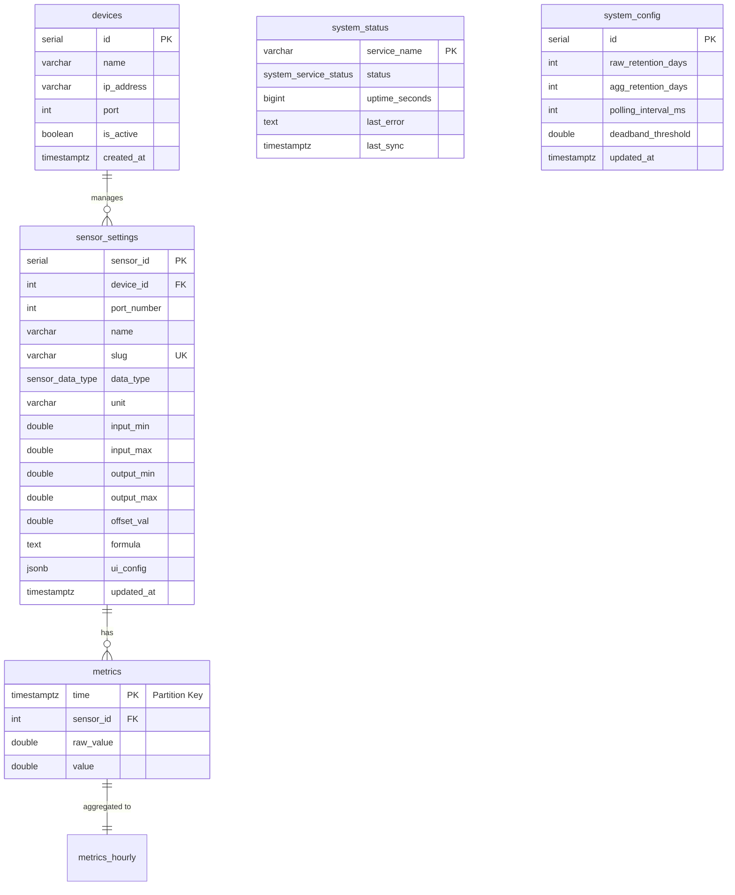

# Архитектура БД IIoT System (TimescaleDB)

## Обзор системы
База данных спроектирована на базе **PostgreSQL** с расширением **TimescaleDB** для эффективной работы с временными рядами. Система поддерживает автоматическое сжатие данных, непрерывную агрегацию и управление жизненным циклом (Retention Policy).

## Схема данных (ER-диаграмма)

## Перечисления (Enums)

### `sensor_data_type`
Тип физической или логической природы источника данных.
- `ANALOG`: Аналоговый сигнал (требует калибровки через min/max).
- `DIGITAL`: Дискретный сигнал (0 или 1).
- `VIRTUAL`: Вычисляемое значение на основе формулы.

### `system_service_status`
Текущее состояние системных компонентов.
- `ONLINE`, `OFFLINE`, `DEGRADED`, `CRITICAL_ERROR`, `MAINTENANCE`.

---

## Детальное описание таблиц

### 1. `devices`
Реестр физических контроллеров/устройств сбора данных (PLC, IoT Gateway).

| Поле | Тип данных | Ограничения | Описание |
| :--- | :--- | :--- | :--- |
| **id** | `SERIAL` | `PRIMARY KEY` | Уникальный ID устройства |
| **name** | `VARCHAR(100)` | `NOT NULL` | Человекочитаемое имя |
| **ip_address** | `VARCHAR(50)` | `NOT NULL` | IP адрес (например, '192.168.0.10') |
| **port** | `INT` | `DEFAULT 502` | Порт Modbus TCP |
| **is_active** | `BOOLEAN` | `DEFAULT TRUE` | Флаг активности опроса |
| **created_at** | `TIMESTAMPTZ` | `DEFAULT NOW()` | Дата добавления |

### 2. `sensor_settings`
Реестр конфигураций датчиков и параметров нормализации сигналов.

| Поле | Тип данных | Ограничения | Описание |
| :--- | :--- | :--- | :--- |
| **sensor_id** | `SERIAL` | `PRIMARY KEY` | Уникальный ID датчика |
| **device_id** | `INT` | `FK (devices.id)` | Ссылка на устройство |
| **port_number** | `INT` | `UNIQUE (dev_id, port)` | Номер физического порта/регистра |
| **name** | `VARCHAR(100)` | `NOT NULL` | Название (для UI) |
| **slug** | `VARCHAR(50)` | `UNIQUE` | Уникальный ключ для API/формул |
| **data_type** | `sensor_data_type` | `DEFAULT 'ANALOG'` | Природа сигнала |
| **unit** | `VARCHAR(20)` | - | Единица измерения (°C, Bar) |
| **input_min** | `DOUBLE PRECISION` | `DEFAULT 0` | Мин. сигнал (АЦП) |
| **input_max** | `DOUBLE PRECISION` | `DEFAULT 65535` | Макс. сигнал (АЦП) |
| **output_min** | `DOUBLE PRECISION` | `DEFAULT 0` | Мин. физическое значение |
| **output_max** | `DOUBLE PRECISION` | `DEFAULT 100` | Макс. физическое значение |
| **offset_val** | `DOUBLE PRECISION` | `DEFAULT 0` | Программная коррекция (смещение) |
| **formula** | `TEXT` | - | Формула для виртуальных датчиков |
| **ui_config** | `JSONB` | `DEFAULT '{}'` | Настройки UI (иконки, цвета) |
| **updated_at** | `TIMESTAMPTZ` | `DEFAULT NOW()` | Время последнего изменения |

### 3. `metrics`
Основная гипертаблица для хранения временных рядов телеметрии.

| Поле | Тип данных | Ограничения | Описание |
| :--- | :--- | :--- | :--- |
| **time** | `TIMESTAMPTZ` | `PK (Part), NOT NULL` | Метка времени (UTC) |
| **sensor_id** | `INT` | `FK (sensor_settings)`| Ссылка на датчик (CASCADE) |
| **raw_value** | `DOUBLE PRECISION` | - | Сырое значение (до калибровки) |
| **value** | `DOUBLE PRECISION` | `NOT NULL` | Калиброванное физическое значение |

### 4. `system_status`
Мониторинг текущего состояния и здоровья системных сервисов.

| Поле | Тип данных | Ограничения | Описание |
| :--- | :--- | :--- | :--- |
| **service_name** | `VARCHAR(50)` | `PRIMARY KEY` | Имя сервиса (Collector, API...) |
| **status** | `system_service_status`| `DEFAULT 'OFFLINE'` | Текущий статус |
| **uptime_seconds**| `BIGINT` | `DEFAULT 0` | Время работы в сек. |
| **last_error** | `TEXT` | - | Текст последней ошибки |
| **last_sync** | `TIMESTAMPTZ` | `DEFAULT NOW()` | Время последнего "heartbeat" |

### 5. `system_config`
Глобальные настройки системы и параметры политик хранения.

| Поле | Тип данных | Ограничения | Описание |
| :--- | :--- | :--- | :--- |
| **id** | `SERIAL` | `PRIMARY KEY` | ID конфига |
| **raw_retention_days**| `INT` | `DEFAULT 90` | Хранение сырых данных (дни) |
| **agg_retention_days**| `INT` | `DEFAULT 1825` | Хранение агрегатов (дни) |
| **polling_interval_ms**| `INT` | `DEFAULT 1000` | Интервал опроса Modbus |
| **config_reload_interval_sec**| `INT` | `DEFAULT 60` | Интервал перечитки конфига |
| **health_check_interval_sec**| `INT` | `DEFAULT 30` | Интервал проверки здоровья |
| **deadband_threshold**| `DOUBLE PRECISION` | `DEFAULT 0.01` | Порог фильтрации шума |
| **data_heartbeat_sec**| `INT` | `DEFAULT 600` | Макс. простой без данных |
| **updated_at** | `TIMESTAMPTZ` | `DEFAULT NOW()` | Время обновления |

### 6. `maintenance_logs`
Журнал аудита выполнения автоматических процедур обслуживания.

| Поле | Тип данных | Ограничения | Описание |
| :--- | :--- | :--- | :--- |
| **log_time** | `TIMESTAMPTZ` | `DEFAULT NOW()` | Время события |
| **table_name** | `VARCHAR(100)` | `NOT NULL` | Имя компонента/таблицы |
| **description**| `TEXT` | - | Что произошло |
| **status** | `VARCHAR(10)` | `NOT NULL` | SUCCESS или ERROR |

---

## Аналитика и Агрегация

### `metrics_hourly` (Continuous Aggregate)
Материализованное представление для быстрой аналитики.

| Поле | Тип данных | Описание |
| :--- | :--- | :--- |
| **bucket** | `TIMESTAMPTZ` | Начало часового интервала |
| **sensor_id** | `INT` | ID датчика |
| **avg_value** | `DOUBLE PRECISION` | Среднее за час |
| **max_value** | `DOUBLE PRECISION` | Максимум за час |
| **min_value** | `DOUBLE PRECISION` | Минимум за час |

---

## Автоматизация и Обслуживание

1. **Retention Policy (`prc_run_retention`):** Раз в сутки удаляет старые данные на основе `system_config`.
2. **Compression:** Сжатие данных в таблице `metrics` через 7 дней (группировка по `sensor_id`).
3. **Notify System:** Триггер `trg_notify_metric` отправляет JSON в канал `metrics_realtime` при каждой вставке в `metrics`.